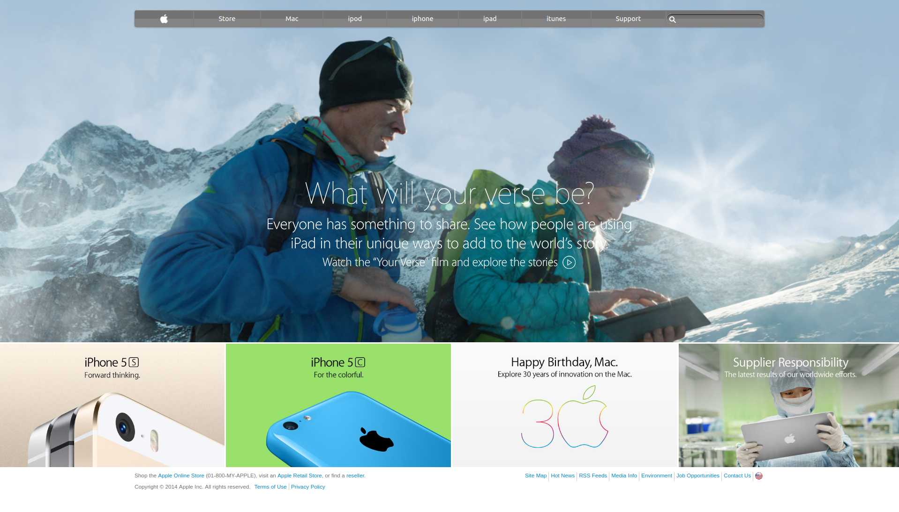

# HTML5 & CSS3 Apple homepage clone

Using backgrounds and gradients with a clone of an Apple webpage using HTML5 and CSS3. Made use of Flexbox and Grid display properties.

This was a solo project, the goal was to practice backgrounds, gradients and element positioning while using the git flow.

## Built With

- HTML 5
- CSS3
- Flexbox & Grid display properties

## Live Demo

[Click to view the finished page!](https://meltrust.github.io/Apple-Page-Clone/)

## Getting Started

To get a local copy up and running follow these simple example steps.
- Clone the project unto your local machine.
- Navigate into `index.html` file and run on the browser.

## Future Features:

- Implement responsive design.

## Authors

👤 **Author**

- [@Meltrust](https://github.com/Meltrust)
- Linkedin: https://www.linkedin.com/in/meltrust
- Contact me: original.mtapia@outlook.com

## 🤝 Contributing

Contributions, issues and feature requests are welcome!

Feel free to check the [issues page](issues/).

## Show your support

Give a ⭐️ if you like this project!

## Acknowledgments

- Hat tip to anyone whose code was used
- Inspiration
- etc

## 📝 License

This project is [MIT](lic.url) licensed.
